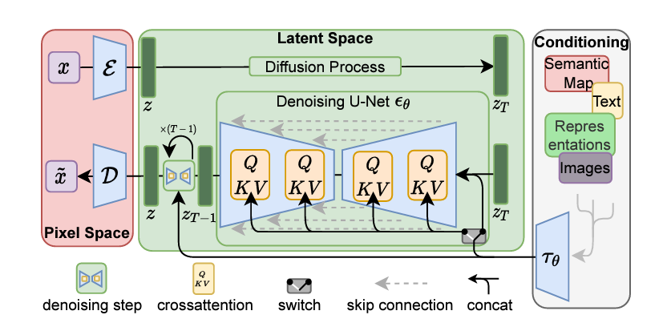

# Stable Diffusion - Pytorch

Pytorch Implementation of the [Stable Diffusion](https://arxiv.org/abs/2112.10752) from scratch.

**Abstract**: *By decomposing the image formation process into a sequential application of denoising autoencoders, diffusion models (DMs) achieve state-of-the-art synthesis results on image data and beyond. Additionally, their formulation allows for a guiding mechanism to control the image generation process without retraining. However, since these models typically operate directly in pixel space, optimization of powerful DMs often consumes hundreds of GPU days and inference is expensive due to sequential evaluations. To enable DM training on limited computational resources while retaining their quality and flexibility, we apply them in the latent space of powerful pretrained autoencoders. In contrast to previous work, training diffusion models on such a representation allows for the first time to reach a near-optimal point between complexity reduction and detail preservation, greatly boosting visual fidelity. By introducing cross-attention layers into the model architecture, we turn diffusion models into powerful and flexible generators for general conditioning inputs such as text or bounding boxes and high-resolution synthesis becomes possible in a convolutional manner. Our latent diffusion models (LDMs) achieve new state-of-the-art scores for image inpainting and class-conditional image synthesis and highly competitive performance on various tasks, including text-to-image synthesis, unconditional image generation and super-resolution, while significantly reducing computational requirements compared to pixel-based DMs.*

## Download weights and tokenizer files:

1. Download `vocab.json` and `merges.txt` from https://huggingface.co/stable-diffusion-v1-5/stable-diffusion-v1-5/tree/main/tokenizer and save them in the `data` folder
2. Download `v1-5-pruned-emaonly.ckpt` from https://huggingface.co/stable-diffusion-v1-5/stable-diffusion-v1-5/tree/main and save it in the `data` folder

## Tested fine-tuned models:

Just download the `ckpt` file from any fine-tuned SD (up to v1.5).

1. InkPunk Diffusion: https://huggingface.co/Envvi/Inkpunk-Diffusion/tree/main
2. Illustration Diffusion (Hollie Mengert): https://huggingface.co/ogkalu/Illustration-Diffusion/tree/main

### References

- https://github.com/hkproj/pytorch-stable-diffusion
- https://github.com/CompVis/stable-diffusion/
- https://github.com/divamgupta/stable-diffusion-tensorflow
- https://github.com/kjsman/stable-diffusion-pytorch
- https://github.com/huggingface/diffusers/
